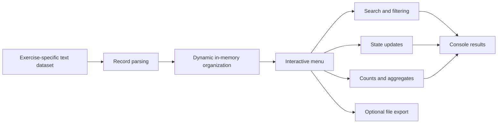

# Dynamic Linked Data Structures in C

Dynamic Linked Data Structures in C is a collection of thirteen standalone console applications that explore the design and use of dynamic data structures through realistic management and analysis scenarios. The work covers vehicle and bicycle rentals, building automation, financial transactions, library lending, service queues, environmental monitoring, transport flows, race rankings, pharmacy purchases, and image archives. Each exercise transforms a text dataset into an appropriate in-memory representation and exposes interactive operations for searching, filtering, updating, grouping, or aggregating the stored information.

## Learning Objectives

The repository demonstrates how to:

- model domain records with C structures;
- create and traverse singly linked lists;
- implement first-in, first-out queues;
- organize records in arrays of lists or queues;
- build nested list structures for grouped data;
- allocate result arrays and filtered collections dynamically;
- load structured records from plain-text files;
- perform searches, state transitions, counts, percentages, and aggregate calculations;
- manage interactive, menu-driven console workflows.

## Exercise Catalogue

Each directory contains an independent C program and its associated sample dataset.

| Exercise | Scenario | Main data-structure focus | Dataset |
| --- | --- | --- | --- |
| 01 | Car-rental fleet management, availability, rentals, and vehicle selection | Linked lists and dynamic arrays | `vetture.txt` |
| 02 | Heating schedules grouped by room and active-room lookup by time | Lists and nested lists | `termostato.txt` |
| 03 | Bicycle-rental inventory, rental transitions, and cost-based selection | Linked lists and dynamic arrays | `biciclette.txt` |
| 04 | Electronic-payment cashback calculation and customer transaction extraction | Linked lists and dynamic arrays | `operazioni.txt` |
| 05 | Library lending, availability tracking, and catalogue filtering | Linked lists and dynamic arrays | `libri.txt` |
| 06 | Post-office bookings, service queues, completed operations, and operation counts | Arrays of queues, linked lists, and arrays | `prenotati.txt` |
| 07 | Weather measurements grouped by station and annual temperature analysis | Arrays of linked lists and dynamic arrays | `misurazioni.txt` |
| 08 | Precision-agriculture measurements grouped by monitored area | Arrays of linked lists and filtered lists | `misurazioni.txt` |
| 09 | Motorway toll records, time-range revenue, and vehicle percentages | Arrays of linked lists and aggregate arrays | `transiti.txt` |
| 10 | Passport-control traffic, provenance counts, and nationality percentages | Arrays of linked lists and aggregate arrays | `transiti.txt` |
| 11 | Running-race rankings grouped by category, average times, searches, and export | Arrays of queues and linked lists | `dati.txt` |
| 12 | Pharmacy purchases grouped by checkout, prescription counts, and tax-deduction percentages | Arrays of linked lists and aggregate arrays | `acquisti.txt` |
| 13 | Photo archive grouped by image type, date filtering, and resolution counts | Ordered lists of lists | `archivio.txt` |

## Common Processing Model

Although every exercise addresses a different domain, the applications share a consistent processing flow.



The optional export path applies to the race-ranking exercise, which can save the ranking for a selected category in a new text file.

## Requirements

To build and run the exercises, the system must provide:

- a C compiler with C11 support, such as GCC or Clang;
- a terminal capable of running interactive console programs;
- the standard C library, with no third-party dependencies.

The commands below use GCC on Windows and the system C compiler on macOS and Linux. Confirm that the selected compiler is available before building:

Windows PowerShell:

```powershell
gcc --version
```

macOS or Linux:

```sh
cc --version
```

## Build Instructions

Open a terminal in the repository root. Every source file is compiled into an executable stored in the same directory as its dataset.

### Windows

Run the following PowerShell command from the repository root to build all thirteen exercises:

```powershell
Get-ChildItem -Directory -Filter "Exercise *" | ForEach-Object {
    $source = Get-ChildItem -LiteralPath $_.FullName -Filter "*.c" | Select-Object -First 1
    gcc -std=c11 $source.FullName -o (Join-Path $_.FullName "exercise.exe")
}
```

To compile only one exercise, use its source file directly. For example:

```powershell
gcc -std=c11 "Exercise 01\exercise_01.c" -o "Exercise 01\exercise.exe"
```

### macOS and Linux

Run the following shell command from the repository root to build all thirteen exercises:

```sh
for directory in Exercise\ *; do
    source_file=$(find "$directory" -maxdepth 1 -name '*.c' -print -quit)
    cc -std=c11 "$source_file" -o "$directory/exercise"
done
```

To compile only one exercise, use its source file directly. For example:

```sh
cc -std=c11 "Exercise 01/exercise_01.c" -o "Exercise 01/exercise"
```

## Run Instructions

Run each application from its own directory. This working-directory requirement allows the program to locate the bundled dataset by its local filename.

### Windows

From the repository root:

```powershell
Set-Location "Exercise 01"
.\exercise.exe
```

Return to the repository root before selecting another exercise:

```powershell
Set-Location ..
```

### macOS and Linux

From the repository root:

```sh
(cd "Exercise 01" && ./exercise)
```

Replace `01` with any value from `02` through `13` to run the remaining applications. Each application is interactive and should be completed or closed before starting another one.

## Application Workflow

The programs present numbered menus in the terminal. A typical session follows this order:

1. Select the data-loading option, normally option `1`.
2. If the application requests a filename, enter the dataset name shown in the exercise catalogue.
3. Select the available search, update, filtering, or aggregation operations.
4. Enter values using the format requested by the prompt, including dates, times, identifiers, categories, or numeric thresholds.
5. Select option `0` to close the application.

Loading the dataset before invoking the analytical or update operations ensures that the required in-memory structures have been initialized. The console prompts are written in Italian, while dates and times use the formats shown by each program.

## Input and Output

All bundled inputs are whitespace-delimited text files. Their fields vary by scenario and include identifiers, descriptive values, states, dates, times, measurements, and monetary amounts. The applications read these files without requiring a database or network service.

Results are printed to the terminal and may include complete collections, filtered records, updated availability states, totals, percentages, or per-group statistics. Exercise 11 can also create a text file containing the ranking for a selected competition category. Because relative filenames are used, generated files are written to the directory from which the corresponding executable is launched.

## Verification

The bundled datasets provide reproducible inputs for manual verification. For each exercise:

1. Start the executable from the matching exercise directory.
2. Load the supplied dataset and confirm that the program displays the imported records or total record count.
3. Exercise every menu operation with values present in the dataset.
4. Repeat filtering and aggregation operations with different ranges or categories.
5. Exit through option `0` after completing the session.

This process validates file loading, dynamic structure creation, traversal, domain operations, result generation, and the complete interactive flow of each standalone application.
